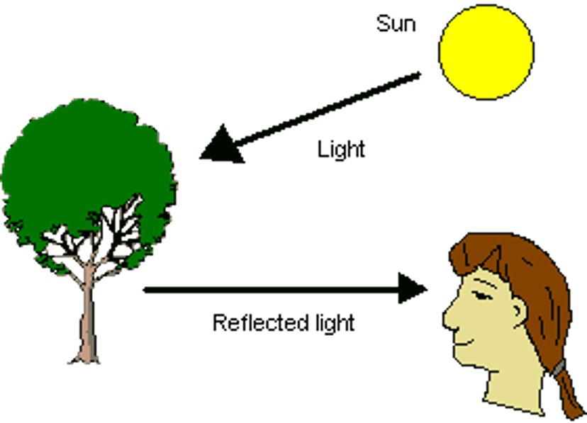
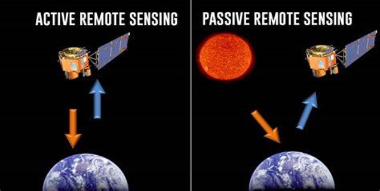
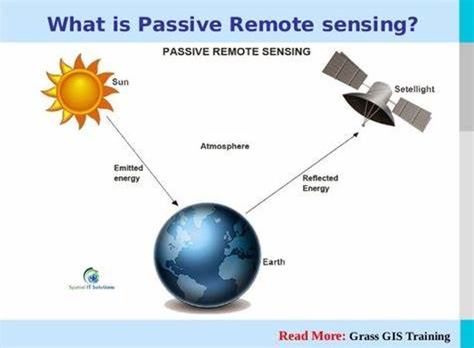
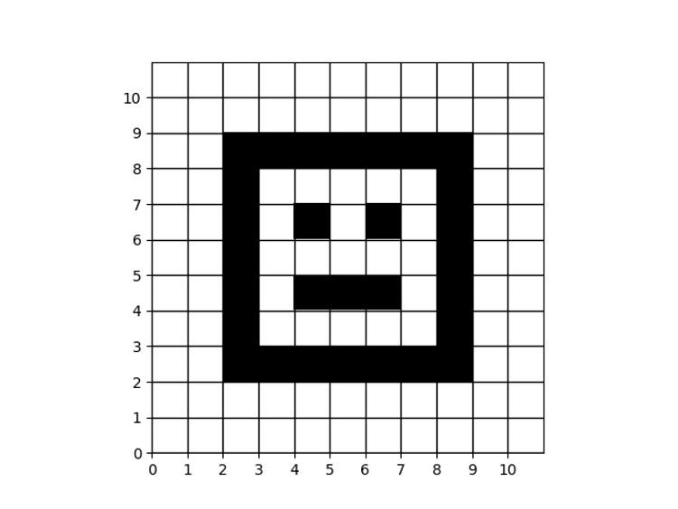

### **How we see any object?**
To see an object, three things are required: 

There should be some light source.

2. Light from a light source should fall on an object and
 the object should reflect light that falls on its surface.

3. Light reflected from the object should reach our eye.

### **Light absorption and reflection** 

- Absorption: Trees absorb more red light and reflect more near-infrared light. 

- Reflection: Healthy vegetation, including trees, tends to reflect more near-infrared light and less red light. This results in a higher NDVI value. Unhealthy or sparse vegetation may have a lower NDVI value due to reduced reflectance in the near-infrared spectrum.

### **Light absorption and reflection by plant**

### **Remote sensing**

Remote sensing is the process of collecting information about an object or area without making physical contact with it. 
There are two main types of remote sensing, based on how they collect data: active and passive.

### **Passive remote sensing 

Passive remote sensing is a type of remote sensing that detects natural energy that is reflected or emitted by an object.  

### **How computer see an image?**

When a computer "sees" an image, it doesn't perceive it like humans do. Instead, it breaks it down into tiny dots called pixels. Each pixel has a color value represented by numbers. These numbers tell the computer how much red, green, and blue are present in that pixel, forming different colors.

### **Formation of a black and white image**

For a black and white image, each pixel is either black or white, represented by numbers where 0 might indicate black and 1 might indicate white. The computer reads these values to create the image.

### **Formation of a RGB image**

- An RGB (Red, Green, Blue) image is formed by combining three different color channels: red, green, and blue. Each pixel in the image is represented by a combination of intensity values for these three colors.

- For example, a pixel might have a certain intensity of red, green, and blue, which together create a specific color. The intensity values for each color channel typically range from 0 to 255, where 0 represents no intensity (no color) and 255 represents maximum intensity (full color).

### **RGB channel separation** 

### **Multispectral Imagery**

-Multispectral imagery captures data in a few discrete bands within the electromagnetic spectrum, typically ranging from three to ten bands.

-These bands are usually selected to correspond to specific wavelengths where particular features or materials of interest exhibit unique spectral signatures.

-Multispectral imagery is commonly used in applications such as land cover classification, agriculture monitoring, and environmental assessment.

### **Multispectral Bands** 

- **Blue (B)**: Wavelength Range: 450 - 520 nanometers (nm)
- **Green (G)**: Wavelength Range: 520 - 600 nm
- **Red (R)**: Wavelength Range: 630 - 690 nm
- **Near Infrared (NIR)**: Wavelength Range: 750 - 950 nm
- **Shortwave Infrared (SWIR)**:
  - **SWIR-1**: Wavelength Range: 1,350 - 1,750 nm
  - **SWIR-2**: Wavelength Range: 1,750 - 2,500 nm

### **Multispectral Bands of Satellite** 

Few satellites commonly used for multispectral remote sensing along with their spectral bands:

1. **Landsat Program**:
   - Landsat 8:
     - Band 1 (Coastal/Aerosol): 0.433 - 0.453 µm
     - Band 2 (Blue): 0.450 - 0.515 µm
     - Band 3 (Green): 0.525 - 0.600 µm
     - Band 4 (Red): 0.630 - 0.680 µm
     - Band 5 (Near Infrared): 0.845 - 0.885 µm
     - Band 6 (Shortwave Infrared 1): 1.560 - 1.660 µm
     - Band 7 (Shortwave Infrared 2): 2.100 - 2.300 µm
   - Landsat 7 (ETM+):
     - Similar to Landsat 8 with slight differences.

2. **Sentinel-2**:
   - Sentinel-2A and Sentinel-2B:
     - Band 1 (Coastal/Aerosol): 0.443 - 0.453 µm
     - Band 2 (Blue): 0.490 - 0.510 µm
     - Band 3 (Green): 0.559 - 0.570 µm
     - Band 4 (Red): 0.650 - 0.680 µm
     - Band 5 (Vegetation Red Edge): 0.697 - 0.713 µm
     - Band 6 (Vegetation Red Edge): 0.732 - 0.748 µm
     - Band 7 (Vegetation Red Edge): 0.773 - 0.793 µm
     - Band 8 (Near Infrared): 0.783 - 0.899 µm
     - Band 8A (Narrow Near Infrared): 0.855 - 0.875 µm
     - Band 9 (Water Vapor): 0.940 - 0.960 µm
     - Band 10 (Cirrus): 1.360 - 1.390 µm
     - Band 11 (Shortwave Infrared 1): 1.560 - 1.660 µm
     - Band 12 (Shortwave Infrared 2): 2.100 - 2.300 µm

3. **MODIS (Moderate Resolution Imaging Spectroradiometer)**:
   - MODIS on Terra and Aqua:
     - 36 spectral bands in total covering visible, near-infrared, and thermal wavelengths.
